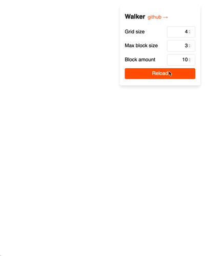

# Walker

## What it does
It generates a list of random position on a grid, where

- each pair of positions has to share at least one edge
- no repeating positions
- the amount of grid columns is customizable
- the maximum size of generated position is customizable

[Interactive demo on Netlify](https://walker.netlify.com/)



## Install

```bash
yarn add @d4rek/walker
npm i @d4rek/walker
```

## Usage

```js
import Walker from '@d4rek/walker'

const walker = new Walker({
  gridSize: 4,     // required. The amount of columns for the grid
  maxBlockSize: 3, // optional. The maximum size of the generated block (position begin to position end)
})


walker.walk(10, {               // required. The amount of positions should be generated
  fromPos: { begin: 2, end: 4 } // Optional. A position to start the chain
})
// [ { begin: 2, end: 9 },
//   { begin: 8, end: 9 },
//   { begin: 8, end: 4 },
//   { begin: 8, end: 5 },
//   { begin: 6, end: 5 },
//   { begin: 4, end: 5 },
//   { begin: 4, end: 6 },
//   { begin: 9, end: 6 },
//   { begin: 9, end: 0 },
//   { begin: 6, end: 0 } ]

```

For an example with react & css grid, see the source code of the demo site in `./playground`

